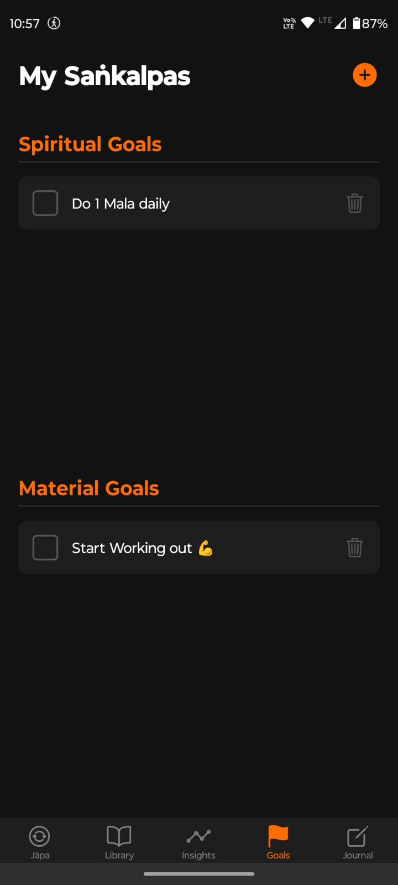
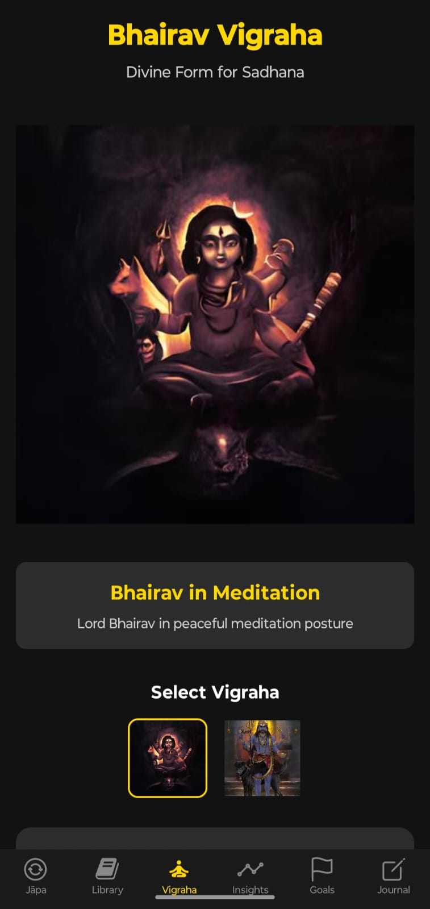

# 🕉️ SadhnaFlow - Digital Sadhana Companion

<div align="center">
  
  
  **॥ ॐ भैरवाय नमः ॥**
  
  *"धर्मे च अर्थे च कामे च मोक्षे च भरतर्षभ।  
  यदिहास्ति तदन्यत्र यन्नेहास्ति न तत्क्वचित्॥"*
  
  *"Whatever exists here, exists elsewhere too. What does not exist here, does not exist anywhere."*
</div>

---
<div align="center">
  🙏 श्री कालभैरव स्तुति

<https://github.com/user-attachments/assets/60196a6d-5c81-4384-8972-12ab1d350b47>

*॥ॐ क्रों कालभैरवाय नमः॥*

*काल भैरव काल भैरव काल भैरव पाहि माम्।  
त्राहि माम् शरणागत देहि मे शरणम् सदा॥*

*Kaal Bhairav Kaal Bhairav Kaal Bhairav Paahi Maam  
Traahi Maam Sharanagata Dehi Me Sharanam Sadaa*
</div>

## 📱 Demo Video

<div align="center">

<https://github.com/user-attachments/assets/6474d1b2-1ca8-49eb-9778-651d5dd0ac64>

*Experience the divine journey through SadhnaFlow*

**📱 See in Action:** Japa Counter • Sacred Audio • Goal Tracking • Spiritual Journal

</div>

## ✨ About SadhnaFlow

SadhnaFlow is a sacred digital companion designed to enhance your spiritual journey through traditional Hindu practices. Dedicated to **श्री कालभैरव** (Shri Kaal Bhairav), this app brings ancient wisdom into the modern era, helping devotees maintain consistent sadhana (spiritual practice) with devotion and discipline.

### 🌟 Spiritual Significance

*"साधना वे करता है जो स्वयं को जानना चाहता है"*  
*"Sadhana is done by one who wishes to know oneself"*

In the tradition of Sanatan Dharma, regular spiritual practice is the pathway to self-realization. SadhnaFlow honors this sacred tradition by providing:

- **Digital Japa Mala** for mantra chanting
- **Sacred Audio Library** with authentic recitations
- **Spiritual Goal Tracking** for consistent practice
- **Personal Journal** for spiritual insights
- **Progress Analytics** to track your spiritual growth

---

## 📱 Features

### 🔢 Japa Counter

- Digital mala for accurate count tracking
- Multiple mantras and prayers support
- Session history and statistics
- Audio accompaniment with sacred chants

### 🎵 Audio Library

- **Bhairav Ashtottara** - 108 names of Lord Bhairav
- **Bhairav Tandav** - Divine cosmic dance
- **Bhairava Stotra** - Sacred hymns
- **Kaal Bhairav** - Powerful mantras
- **Hanuman Chalisa** - Complete recitation

### 🎯 Spiritual Goals

- Set daily/weekly spiritual targets
- Track mantra counts and meditation time
- Progress visualization
- Achievement milestones

### 📖 Sacred Library

- Collection of stotras and prayers
- Synchronized audio-text experience
- Sanskrit with transliteration
- Meaning and significance explanations

### 🕉️Vigraha (Divine Form)

- Sacred images of Lord Bhairav for meditation
- Multiple divine forms for visual contemplation
- Sadhana instructions for spiritual practice
- Interactive gallery with detailed descriptions

### 📊Insights & Analytics

- Spiritual practice trends
- Consistency tracking
- Personal growth metrics
- Monthly and yearly reports

### ✍️ Spiritual Journal

- Record daily spiritual experiences
- Meditation insights
- Dream journals
- Gratitude entries

---

## 📸 Screenshots

<div align="center">
  <table>
    <tr>
      <td align="center">
        
        <br><em>Sacred Home</em>
      </td>
      <td align="center">
        
        <br><em>Digital Mala</em>
      </td>
      <td align="center">
        
        <br><em>Sacred Library</em>
      </td>
    </tr>
    <tr>
      <td align="center">
        
        <br><em>Sacred Text</em>
      </td>
      <td align="center">
        
        <br><em>Log Recitation</em>
      </td>
      <td align="center">
        
        <br><em>Progress Insights</em>
      </td>
    </tr>
    <tr>
      <td align="center">
        
        <br><em>Spiritual Goals</em>
      </td>
      <td align="center">
        
        <br><em>Spiritual Journal</em>
      </td>
      <td align="center">
        
        <br><em>Divine Vigraha</em>
      </td>
    </tr>
  </table>
</div>

---

## 🛠️ Technology Stack

- **Framework**: React Native with Expo
- **Language**: TypeScript
- **Navigation**: Expo Router
- **Storage**: AsyncStorage
- **Audio**: Expo AV
- **UI**: React Native Components

---

## 🚀 Getting Started

### Prerequisites

- Node.js (v16 or higher)
- npm or yarn
- Expo CLI
- Android Studio / Xcode (for device testing)

### Installation

1. **Clone the sacred repository**

   ```bash
   git clone https://github.com/yourusername/SadhnaFlow.git
   cd SadhnaFlow
   ```

2. **Install dependencies**

   ```bash
   npm install
   # or
   yarn install
   ```

3. **Start the development server**

   ```bash
   npx expo start
   ```

4. **Run on device**
   - Scan QR code with Expo Go app
   - Or run on emulator/simulator

---

## 📂 Project Structure

```
SadhnaFlow/
├── app/                    # Main application screens
│   ├── (tabs)/            # Tab-based navigation
│   │   ├── index.tsx      # Home screen
│   │   ├── japa.tsx       # Japa counter
│   │   ├── goals.tsx      # Spiritual goals
│   │   ├── library.tsx    # Sacred library
│   │   ├── vigraha.tsx    # Divine form gallery
│   │   ├── insights.tsx   # Analytics
│   │   └── journal.tsx    # Spiritual journal
│   └── stotra/            # Individual stotra pages
├── components/            # Reusable components
│   ├── AddGoalModal.tsx   # Goal creation modal
│   ├── AudioPlayer.tsx    # Audio playback component
│   ├── CustomSlider.tsx   # Custom UI slider
│   ├── JapaCounter.tsx    # Digital mala counter
│   └── RecitationLogger.tsx # Log spiritual sessions
├── assets/               # Static assets
│   ├── audio/           # Sacred audio files
│   ├── images/          # Icons and divine images
│   │   ├── Batuka_Bhairav.jpg # Divine form images
│   │   └── Kal_Bhairav.jpg    # Sacred iconography
│   ├── screenshots/     # App screenshots
│   └── video/           # Demo video
├── data/                # Spiritual content data
│   └── stotras.ts       # Sacred text database
├── services/            # Storage and API services
│   └── StorageService.ts # Local data management
└── hooks/               # Custom React hooks
    └── useAudioPlayer.ts # Audio playback hook
```

## 🌸 Why Spiritual Practice Matters

### Mental Peace & Clarity

- **Reduces Stress**: Regular chanting and meditation activate the parasympathetic nervous system
- **Improves Focus**: Mantra repetition enhances concentration and mental clarity
- **Emotional Balance**: Spiritual practices help regulate emotions and reduce anxiety

### Spiritual Growth

- **Self-Awareness**: Regular sadhana leads to deeper self-understanding
- **Divine Connection**: Consistent practice strengthens the bond with the divine
- **Karmic Purification**: Sacred chants help purify negative karmas

### Physical Well-being

- **Better Sleep**: Evening prayers and meditation improve sleep quality
- **Reduced Blood Pressure**: Chanting mantras has proven cardiovascular benefits
- **Enhanced Immunity**: Spiritual practices boost overall health and immunity

---

## 📱 Download & Usage

1. **Install** the app on your Android device
2. **Set Daily Goals** for your spiritual practice
3. **Use Japa Counter** for mantra chanting
4. **Listen to Sacred Audio** during practice
5. **View Divine Forms** in Vigraha for meditation
6. **Track Progress** through insights
7. **Maintain** a spiritual journal

---

## 🤝 Contributing

We welcome contributions to enhance this sacred digital companion. Please:

1. Fork the repository
2. Create a feature branch
3. Make your changes with devotion
4. Submit a pull request

### Guidelines

- Maintain the spiritual essence of the app
- Test all features thoroughly
- Follow TypeScript best practices
- Add appropriate documentation

---

## 📄 License

This project is licensed under the MIT License - see the [LICENSE](LICENSE) file for details.

---

## 🙏 Acknowledgments

- **श्री कालभैरव** for divine inspiration
- **Sanatan Dharma** tradition for timeless wisdom
- **Audio Contributors** for sacred recordings
- **Beta Testers** for valuable feedback
- **Open Source Community** for tools and libraries

---

<div align="center">
  
  
  **॥ हर हर महादेव ॥**  
  **॥ श्री कालभैरवाय नमः ॥**
  
  *May this digital companion guide you on your spiritual journey*  
  *आपकी आध्यात्मिक यात्रा में यह दिव्य साथी आपका मार्गदर्शन करे*
  
  ---
  
  **Made with 🕉️ and ❤️ for the spiritual community**
  
  *Version 1.0.0 | Built with React Native & Expo*
</div>

